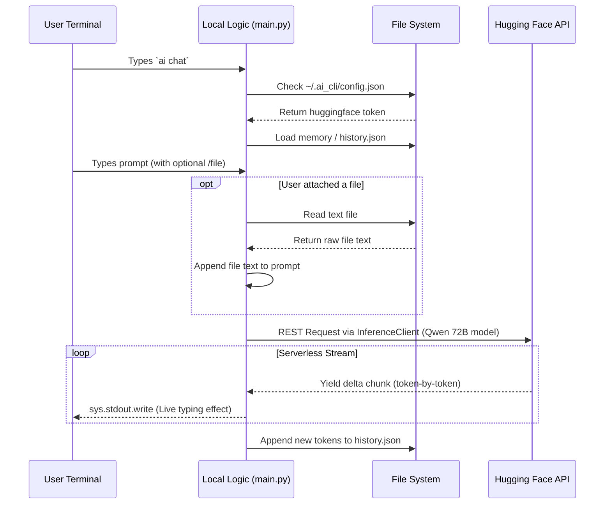

# System Architecture

This document breaks down exactly how the AI Command Line Interface operates under the hood from the ground up!

## Architecture Flow Graph

## How It Works (Step-by-Step)

### 1. The Terminal Entry-Point
When you run `./install.sh`, Python's `setuptools` utilizes our `setup.py` file to automatically compile the `main.py` script into a native global CLI executable named `ai` that gets bound dynamically to your `$PATH`. This allows you to type `ai` from any directory on your computer without being inside the project folder.

### 2. State & Session Management
All logic relies entirely on Python's native modules to be highly cross-platform compatible (`os`, `sys`, `json`, `pathlib`). 
When you execute `ai login`, the application creates a hidden directory in your home user folder (`~/.ai_cli`) to securely store your `config.json` (for your API token) and your `history.json` (to maintain conversation memory between disjointed terminal executions).

### 3. File Context Injection
Before firing a request at the LLM, the CLI intercepts any magic `/file` arguments. If one is found, it uses `os.path` to ingest raw strings from your hard drive, completely formatting them and invisibly injecting them into the user prompt payload in the background before sending it off.

### 4. The Hugging Face Bridge
The brain of the operation utilizes the `huggingface_hub` Python package. Instead of relying on slow HTML web-scraping or brittle browser automation, the tool establishes a strict, authenticated HTTPS REST connection to Hugging Face's serverless inference clusters via `InferenceClient`. 
It requests the model (`Qwen2.5-72B-Instruct`) and activates `stream=True`.

### 5. Native Output Streaming
As Hugging Face's supercomputers process the prompt, they yield individual text fragments (tokens) in real-time. Our CLI intercepts this `generator` stream in python, catches any Unicode Windows console crashes, and immediately flushes the chunks to `sys.stdout`. By bypassing standard Python buffering, it simulates the fast "live typing" effect you see when using official web clients!
